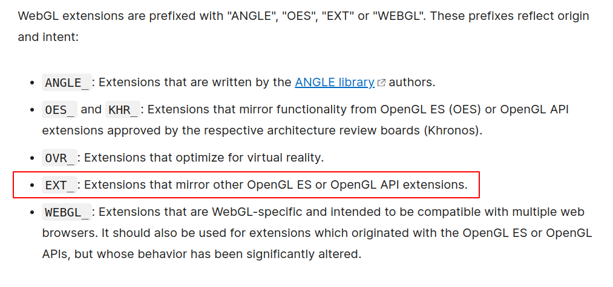

# **CVE-2022-22629 Proof of concept**

This post is about the poc for the WebGL bug that was patched in Safari 15.4 security updates.


If you want to learn in detail about how WebGL works, you can use this official resource since we are going to discuss bug specific details here :

https://webglfundamentals.org/webgl/lessons/webgl-how-it-works.html

**This poc is not about how to get the primitives to exploit this bug, we will just discuss about vulnerablity analysis and how to crash the webcontent : )**


## Introduction

WebGL is a javascript API that is used in browsers to render 2D and 3D graphics. It uses ANGLE component as its primary WebGL backend, significantly improving compatibility with other browsers, and enabling a conformant WebGL 2.0 in WebKit. WebGL offers a lot of extensions for a developer to perform the rendering with optimisations. So, we will look into the extension of which we are concerned about.

## Extensions in WebGL



So, this api provides several extensions for different intents. The bug we are going to discuss is in EXT_. 

You can read more in detail about the extensions from here : 

https://developer.mozilla.org/en-US/docs/Web/API/WebGL_API/Using_Extensions


Anyway, let's move towards the bug :) 

## Vulnerability Analysis

### WEBGL_multi_draw extension

The WEBGL_multi_draw extension is part of the WebGL API and allows to render more than one primitive with a single function call. This can improve a WebGL application's performance as it reduces binding costs in the renderer and speeds up GPU thread time with uniform data.


> This extension exposes the `Multi*` draw call variants in `EXT_multi_draw_arrays` functionality in addition to the vertex shader builtin `gl_DrawID` exposed by `ARB_shader_draw_parameters` for OpenGL.
>
> These functions behave identically to the standard functions `DrawArrays()` and `DrawElements()` except they handle multiple lists of vertices in one call. Their main purpose is to allow one function call to render more than one primitive such as triangle strip, triangle fan, etc.
> 
> Additionally, this extension adds a further built-in variable, `gl_DrawID` to the shading language. This variable contains the index of the draw currently being processed by a `Multi*` variant of a drawing command.

https://github.com/WebKit/WebKit/blob/a7f8eacef337cb6691dca0b742d00f80d4f3dd0f/Source/ThirdParty/ANGLE/extensions/ANGLE_multi_draw.txt

You can read more details about the extension here : 

https://registry.khronos.org/webgl/extensions/WEBGL_multi_draw/

This extension is similar to the webgl api `WebGLRenderingContext.drawArrays()` and `WebGLRenderingContext.drawElements()` etc, that renders primitives from array data. The only difference is that we can render using this extension using multiple arrays. 

We can perform these operations using this extension: [1]

1. `ext.multiDrawArraysWEBGL()` renders multiple primitives from array data (identical to multiple calls to `drawArrays`).

2. `ext.multiDrawElementsWEBGL()` renders multiple primitives from element array data (identical to multiple calls to `drawElements`).

3. `ext.multiDrawArraysInstancedWEBGL()` renders multiple primitives from array data (identical to multiple calls to `drawArraysInstanced`).

4. `ext.multiDrawElementsInstancedWEBGL()` renders multiple primitives from element array data (identical to multiple calls to `drawElementsInstanced`).

### Patch


https://github.com/WebKit/WebKit/commit/c087ca07c9125093ca62e8e44024b738bb7d46dc

**The vulnerability exist only from Safari 15.0 to 15.3 because this extension is only supported in  Safari 15 (ios) in case of apple.**


The patch is very easy to understand and it clearly states that it is a heap buffer overflow while rendering. This function is called here in WebGLMultiDraw.cpp in all the operations we mentioned above [1]. Let's understand what's happening before this function being called. We may look into one of the above function's implementation : 


```cpp
void WebGLMultiDraw::multiDrawArraysWEBGL(GCGLenum mode, Int32List firstsList, GCGLuint firstsOffset, Int32List countsList, GCGLuint countsOffset, GCGLsizei drawcount)
{
    if (!m_context || m_context->isContextLost())
        return;

    if (!validateDrawcount("multiDrawArraysWEBGL", drawcount)
        || !validateOffset("multiDrawArraysWEBGL", "firstsOffset out of bounds", firstsList.length(), firstsOffset, drawcount)
        || !validateOffset("multiDrawArraysWEBGL", "countsOffset out of bounds", countsList.length(), countsOffset, drawcount)) {
        return;
    }

    m_context->graphicsContextGL()->multiDrawArraysANGLE(mode, makeSpanWithOffset(firstsList, firstsOffset), makeSpanWithOffset(countsList, countsOffset), drawcount);
}
```


In JS, the function specifications are defined like this :

```cpp
void ext.multiDrawArraysWEBGL(mode,
    firstsList, firstsOffset,
    countsList, countsOffset,
    drawCount);
```

- `mode`:
  - `gl.POINTS`: Draws a single dot.
  - `gl.TRIANGLES`: Draws a triangle for a group of three vertices.

- `firstsList`:
	- An Int32Array or Array (of GLint) specifying a list of starting indices for the arrays of vector points.

- `firstsOffset`:
	- A GLuint defining the starting point into the firstsLists array.

- `countsList`:
	- An Int32Array or Array (of GLsizei) specifying a list of numbers of indices to be rendered.

- `countsOffset`:
	- A GLuint defining the starting point into the countsList array.

- `drawCount`:
	- A GLsizei specifying the number of instances of the range of elements to execute.

**Looking into the implementation, we can see that we can control the offset and drawcount to draw mode past the size of buffer : )**

So, our POC goes [here](https://github.com/parsdefense/CVE-2022-22629/blob/main/poc.js) ...


## Test


As you can see, our webpage just crashed since the `validateOffset()` called in `multiDrawArraysWEBGL()` doesn't check if our `firstsOffset` is in the range of `[0, size-drawcount]` and we are drawing past the size of of actual buffer. The function call `m_context->graphicsContextGL()->multiDrawArraysANGLE()` is implemented in third party components for WebKit known as ANGLE and it doesn't have any checks before rendering, so we crash writing some bad value to the memory region. 


FYI, `multiDrawArraysANGLE()` pseudocode works like this: 
```javascript
      for(i=0; i<drawcount; i++) {
        if (*(counts+i)>0) DrawArrays(mode, *(firsts+i), *(counts+i));
      }
```

And with the patch applied, it won't render anything and return false through the `validateOffset()` function call:


js) ...


## Credits

PARS Defense Team

We're hiring new team members, contact us: info[at]parsdefense.com
